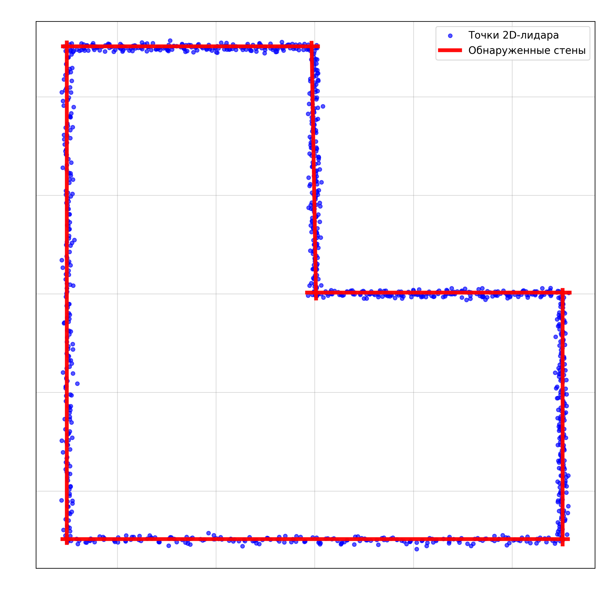
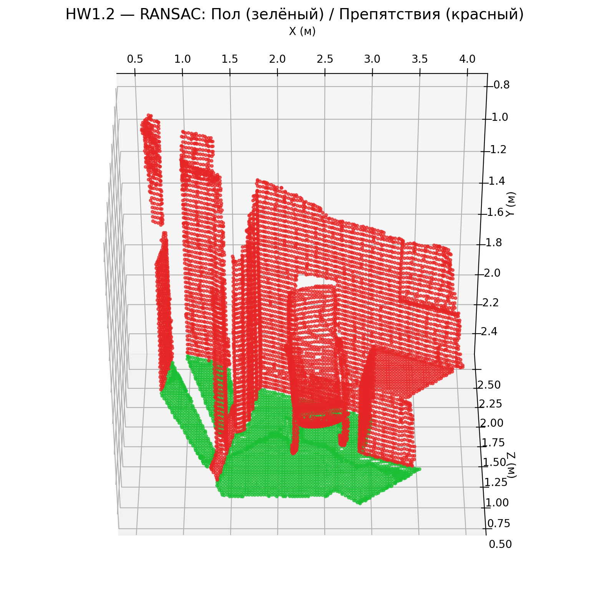

# HW1_Hough_RANSAC — Wall Detection (Hough) & Ground Detection (RANSAC)

## Проблема

**1.1 Wall Detection (2D LIDAR + Hough Transform)**  
Найти прямые линии (стены) в синтетическом облаке точек 2D-лидара.

**1.2 Ground Detection (RANSAC)**  
Выделить плоскость пола из 3D облака точек.

Полное задание приведено в файле: [S26_AR_HW1_Hough_line_detector_RANSAC_plane_detector](S26_AR_HW1_Hough_line_detector_RANSAC_plane_detector.pdf)

## Как решено

* **Задача 1.1**:  
  – Генерация **L-образной комнаты** (6 стен) + шум  
  – Реализация аккумулятора Хафа  
  – Поиск пиков + строгая фильтрация дубликатов  
  – Отрисовка конечных отрезков стен

* **Задача 1.2**:  
  – Загрузка point cloud через Open3D  
  – Реализация RANSAC (1000 итераций)  
  – Окраска: зелёный — пол, красный — препятствия  
  – Сохранение результатов в `images/`

* Библиотеки: `numpy`, `matplotlib`, `open3d`, `random`

## Результаты

**Задача 1.1 — Обнаруженные стены (Hough Transform)**

**Задача 1.2 — Плоскость пола (RANSAC)**

## Выводы

* Hough Transform уверенно находит все 6 стен даже при наличии шума.  
* RANSAC успешно выделяет плоскость пола.  
* Оба алгоритма реализованы чисто, визуализированы и сохранены в `images/`.