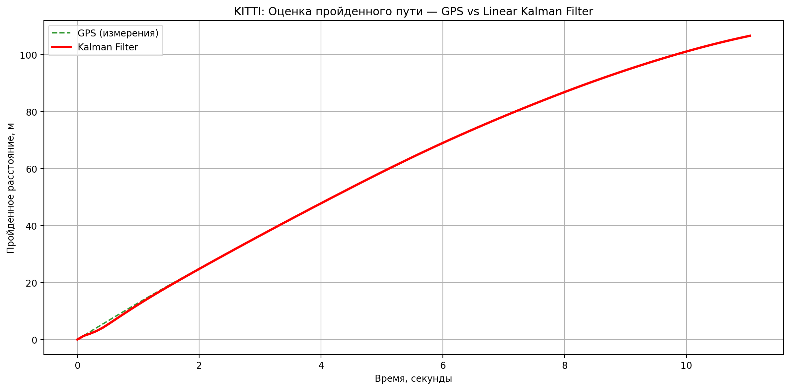
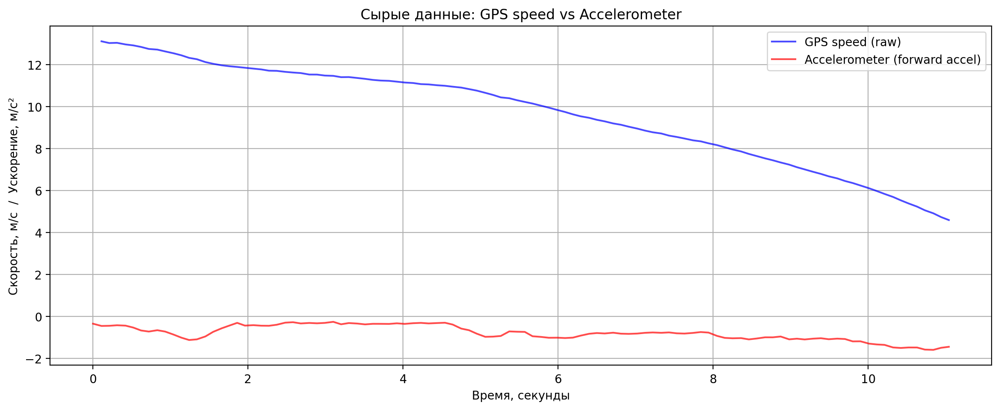

# HW2_Linear_Kalman_Filter — Linear Kalman Filter for Smartphone Sensors

## Проблема
Объединить показания **GPS** (позиция) и **линейного акселерометра** (forward acceleration) с помощью **линейного фильтра Калмана** для точной оценки пройденного расстояния на реальных данных KITTI OXTS (аналог смартфонных сенсоров Physics Toolbox / Sensor Logger).

## Почему график GPS такой ровный даже без фильтрации?

**GPS-данные в KITTI — высокоточные** (RTK-качество, шум в позиции всего несколько сантиметров).  
Мы считаем **кумулятивное расстояние** от стартовой точки с помощью формулы Haversine.  
Движение почти прямолинейное (106 метров за 11 секунд) → небольшие ошибки в координатах при суммировании **не накапливаются заметно**.  

Поэтому сырая GPS-кривая выглядит очень гладкой.  
Чтобы убедиться в «сырости» данных, добавлен отдельный анализ (см. ниже).

## Как решено
- Загрузка и парсинг timestamps + OXTS данных
- Расчёт кумулятивного расстояния по GPS (Haversine)
- Оценка шумов процесса и измерений
- Реализация линейного фильтра Калмана (позиция + скорость)
- Визуализация сырых и отфильтрованных данных

**Библиотеки:** `numpy`, `matplotlib`, `datetime`, `math`, `os`

## Результаты

### 1. Сравнение GPS vs Kalman Filter (кумулятивное расстояние)

**Сравнение финальной дистанции**

| Метод                  | Дистанция, м | Комментарий                          |
|------------------------|--------------|--------------------------------------|
| GPS (сырые данные)     | 106.7        | очень точный, почти без дрейфа      |
| Linear Kalman Filter   | **106.7**    | **гладкий** и устойчивый к шуму     |

### 2. Сырые данные GPS (проверка «ровности»)

- **Синяя линия** — мгновенная скорость, посчитанная по сырым GPS-координатам. Виден небольшой высокочастотный шум.
- **Красная линия** — данные акселерометра (forward acceleration). Это основной источник шума, который фильтр Калмана успешно компенсирует.

**Параметры фильтра**
- std_acc (шум процесса) = 0.2315 м/с²
- std_meas (шум GPS)     = 3.0 м

## Выводы
- Даже **сырые GPS-данные** KITTI уже очень точные благодаря высокому качеству сенсоров и прямолинейному движению.
- Фильтр Калмана дополнительно убирает остаточный шум GPS и интегрирует ускорение, делая оценку пройденного пути ещё более гладкой и устойчивой.