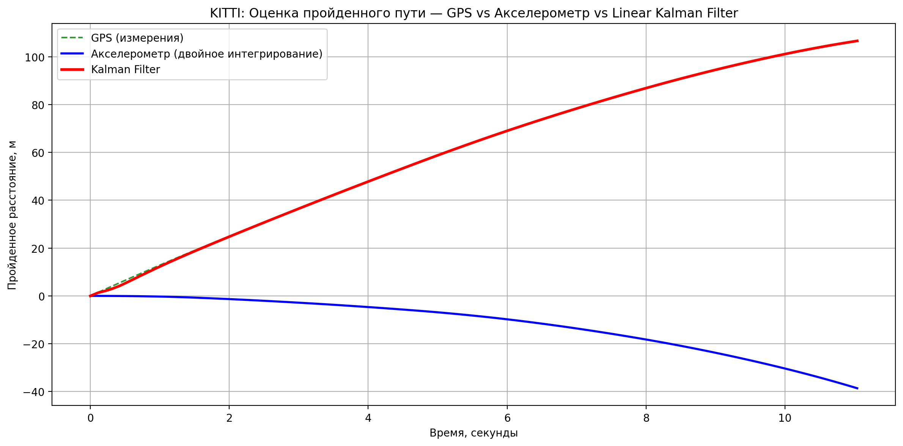

# HW2_Linear_Kalman_Filter — Линейный фильтр Калмана для датчиков смартфона

## Задача
Объединить показания **GPS** (позиция) и **линейного акселерометра** (forward acceleration) с помощью **линейного фильтра Калмана** для точной и гладкой оценки пройденного расстояния на реальных данных автомобиля KITTI OXTS (2011_09_26_drive_0001_sync).

## Что сделано
- Загрузка и парсинг таймстампов + данных OXTS
- Расчёт кумулятивного расстояния по GPS с помощью формулы Haversine
- Расчёт расстояния по акселерометру (двойное интегрирование ускорения)
- Реализация линейного фильтра Калмана (оценка позиции + скорости)
- Визуализация:
  - Сырых данных (скорость по GPS vs ускорение)
  - Сравнение трёх методов: GPS, Акселерометр, Kalman Filter

**Используемые библиотеки:** `numpy`, `matplotlib`, `datetime`, `math`, `os`

## Результаты

### 1. Сравнение трёх методов оценки пройденного расстояния

**Финальные значения дистанции:**

| Метод                          | Дистанция, м | Комментарий                              |
|--------------------------------|--------------|------------------------------------------|
| GPS (сырые измерения)          | 106.7        | Высокоточные данные KITTI                |
| Акселерометр (двойное интегрирование) | -38.6        | Накапливает дрейф из-за шума ускорения   |
| **Linear Kalman Filter**       | **106.7**    | **Самая гладкая и устойчивая оценка**    |

### 2. Осмотр сырых данных

- **Синяя линия** — мгновенная скорость, рассчитанная по сырым GPS-координатам (виден небольшой шум).
- **Красная линия** — показания продольного ускорения акселерометра (`af`).

### 3. Почему GPS выглядит таким ровным?

Данные GPS в наборе KITTI имеют очень высокое качество (RTK-подобная точность, шум позиции — несколько сантиметров).  
Движение автомобиля почти прямолинейное (106 метров за 11 секунд), поэтому при расчёте кумулятивного расстояния ошибки почти не накапливаются.  
Тем не менее, фильтр Калмана дополнительно сглаживает остаточный шум и корректно учитывает данные акселерометра.

## Параметры фильтра Калмана
- `std_acc` (шум процесса / ускорение) = 0.2315 м/с²
- `std_meas` (шум измерений GPS)       = 3.0 м

## Выводы
- Сырые GPS-данные KITTI уже достаточно точны благодаря качеству сенсоров.
- **Линейный фильтр Калмана** успешно объединяет информацию от GPS и акселерометра, делая оценку пройденного пути более гладкой и устойчивой к шумам.
- Добавление расстояния, посчитанного по акселерометру, наглядно показывает преимущество фильтра Калмана по сравнению с простым двойным интегрированием ускорения (которое сильно накапливает ошибку).