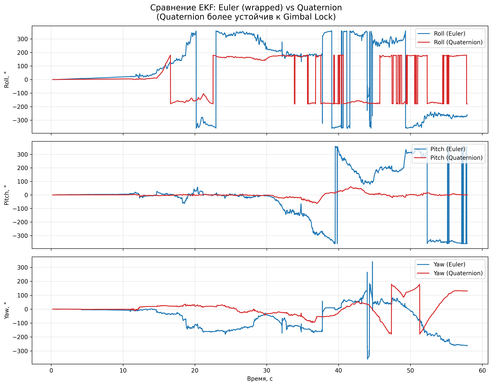
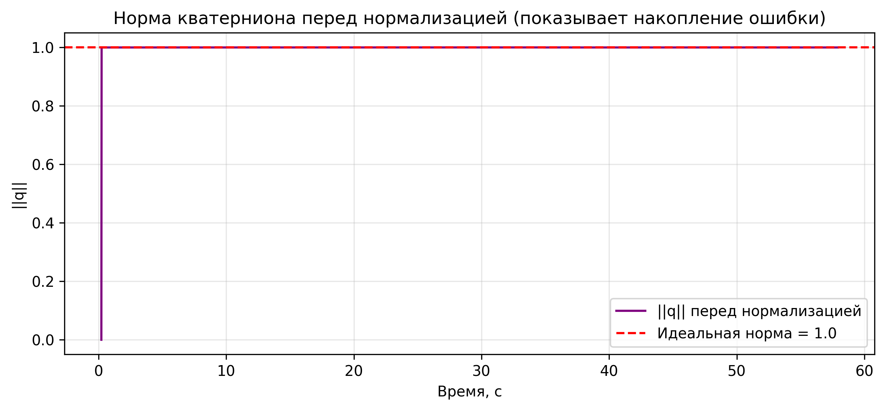

# HW3_EKF_Euler_vs_Quaternion — Euler-based vs Quaternion-based EKF for Smartphone Attitude Estimation

## Assignment Description

**Home assignment #3**: Сравнительный анализ двух вариантов Extended Kalman Filter (EKF) для оценки ориентации смартфона (attitude estimation) — на углах Эйлера и на кватернионах.

Полное задание приведено в файле: [S26_AR_HW3_Euler_based_vs_Quaternion_based_EKF_for_Smartphone_sensors](S26_AR_HW3_Euler_based_vs_Quaternion_based_EKF_for_Smartphone_sensors.pdf)

**Данные**: Один лог 5–10 секунд (акселерометр + гироскоп) с телефона.  
**Критический тест**: Плавный поворот до 90° по оси Pitch (вертикальное положение) — проверка на Gimbal Lock.

## Solution Approach

- Синхронизация данных акселерометра и гироскопа через интерполяцию.
- Два EKF на **одних и тех же данных**:
  - **Variant A**: Euler-based EKF (состояние = [roll, pitch, yaw])
  - **Variant B**: Quaternion-based EKF (состояние = [qw, qx, qy, qz] + нормализация)
- Численное вычисление якобианов (numerical Jacobian).
- Конвертация кватернионов → углы Эйлера для сравнения.
- Визуализация: Roll/Pitch/Yaw на одном графике + график нормы кватерниона (перед нормализацией).

Библиотеки: `pandas`, `numpy`, `sympy`, `matplotlib`.

## Results Summary

### Сравнение углов (Roll, Pitch, Yaw)

Quaternion-based EKF значительно стабильнее: нет скачков и Gimbal Lock, которые наблюдаются у Euler-based EKF при поворотах ~90° по Pitch.

### Норма кватерниона перед нормализацией

Норма отклоняется от 1.0 из-за накопления численной ошибки интегрирования. Нормализация на каждом шаге гарантирует unit-кватернион.

### Выводы по стабильности
- **Euler EKF** — подвержен Gimbal Lock и требует оборачивания углов.
- **Quaternion EKF** — численно устойчив, идеален для 3D-ориентации смартфона.

## Conclusions

Quaternion-based EKF явно превосходит Euler-based по стабильности и устойчивости к Gimbal Lock. График нормы подтверждает необходимость принудительной нормализации.