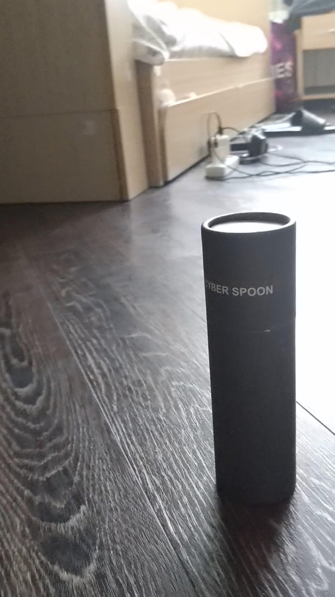
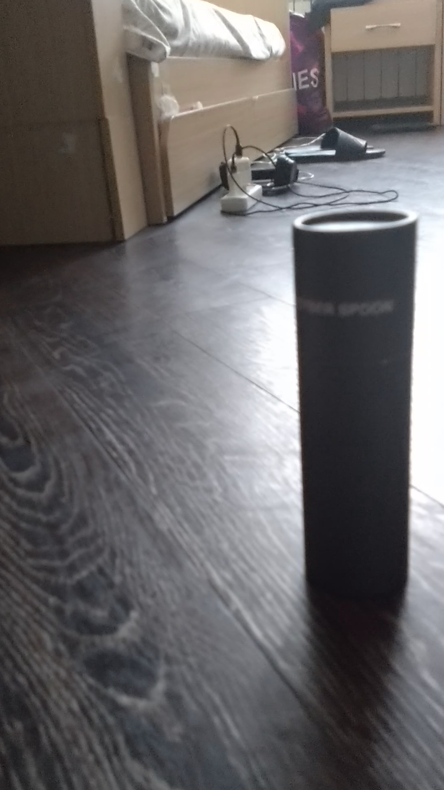

# HW4_Gaussian_Splatting — 3D-реконструкция реального объекта методом Gaussian Splatting

## Assignment Description

**Home assignment #4**: 3D-реконструкция объектов методом Gaussian Splatting (GS).  
Реализация полного пайплайна: видео → 100 кадров → COLMAP (SfM) → Gaussian Splatting (7k и 30k итераций) → сравнение качества + видео 3D-облёта.

Полное задание приведено в файле: [S26_AR_HW4_Gaussian_Splatting.pdf](S26_AR_HW4_Gaussian_Splatting.pdf)

**Данные**: Собственное видео обхода объекта (MOV_0723.mp4).  
**Критический тест**: Сравнение качества реконструкции при 7 000 и 30 000 итераций обучения.

## Solution Approach

- Загрузка видео и равномерное извлечение 100 кадров.
- Запуск COLMAP для построения разреженного облака точек и поз камер.
- Обучение двух моделей Gaussian Splatting:
  - **Короткое обучение**: 7 000 итераций
  - **Полное обучение**: 30 000 итераций
- Рендеринг тестовых видов и генерация анимации 3D-облёта (GIF).
- Сравнение метрик (PSNR, L1 Loss) и визуальная оценка качества.

Библиотеки: `opencv-python`, `colmap`, `torch`, `imageio`, `pandas`, `matplotlib`.

## Results Summary

### Сравнение экспериментов

| Эксперимент                    | PSNR ↑   | L1 Loss ↓ | Время обучения (мин) | Итераций |
|--------------------------------|----------|-----------|----------------------|----------|
| Короткое обучение (7k)         | 32.04    | 0.0173    | 17                   | 7000     |
| Полное обучение (30k) **(лучшее)** | **36.28** | **0.0104** | 94                   | 30000    |

**Вывод по таблице**: Увеличение количества итераций с 7k до 30k даёт значительный прирост качества (PSNR +4.24) и снижение ошибки.

### Визуальные результаты

**Примеры исходных кадров из видео:**

**3D-облёт — 7k итераций (GIF):**

**3D-облёт — 30k итераций:**

## Conclusions

Метод Gaussian Splatting полностью сработал на реальном видео.  
Полное обучение (30 000 итераций) демонстрирует значительно более высокое качество реконструкции, лучшую детализацию и фотореализм по сравнению с коротким обучением.

**Ключевые выводы:**
- COLMAP успешно справился с построением структуры сцены по 100 кадрам.
- Увеличение числа итераций обучения критически важно для качества финальной модели.
- Сгенерированные анимации 3D-облёта подтверждают стабильность и точность полученной 3D-модели.