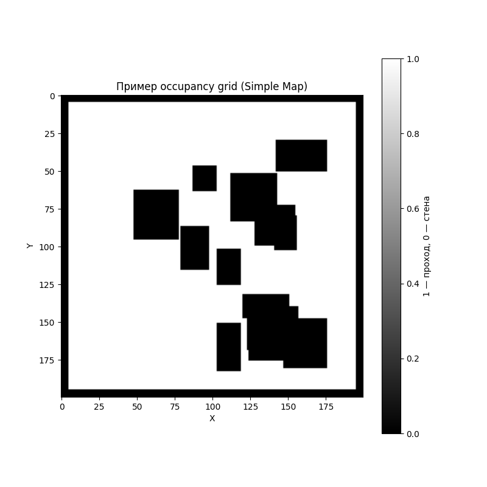
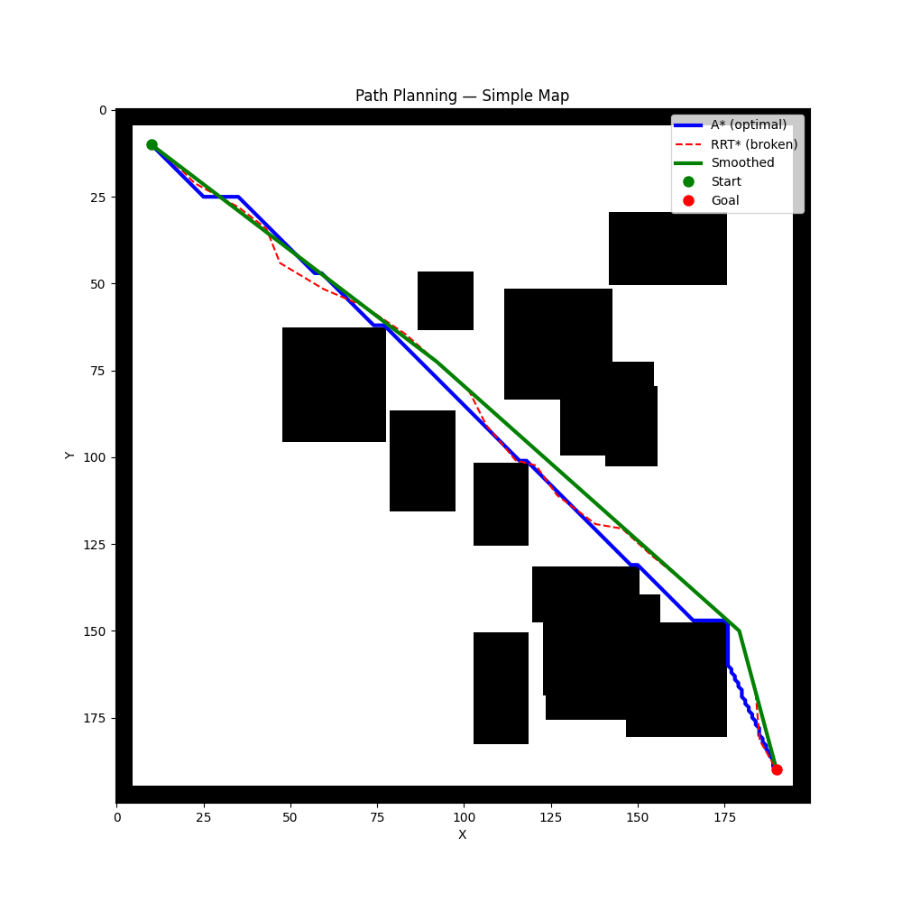
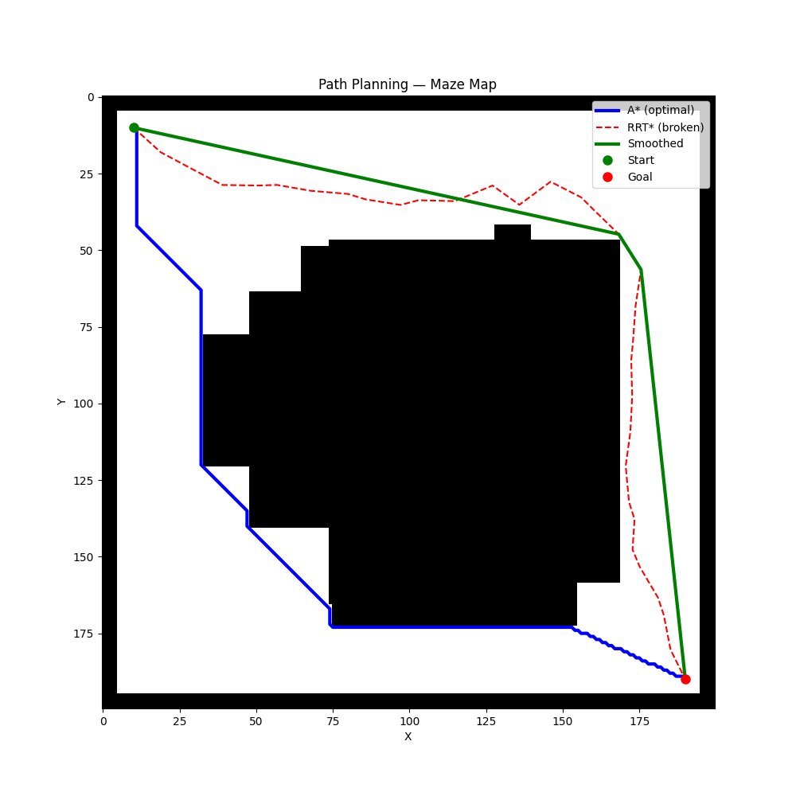
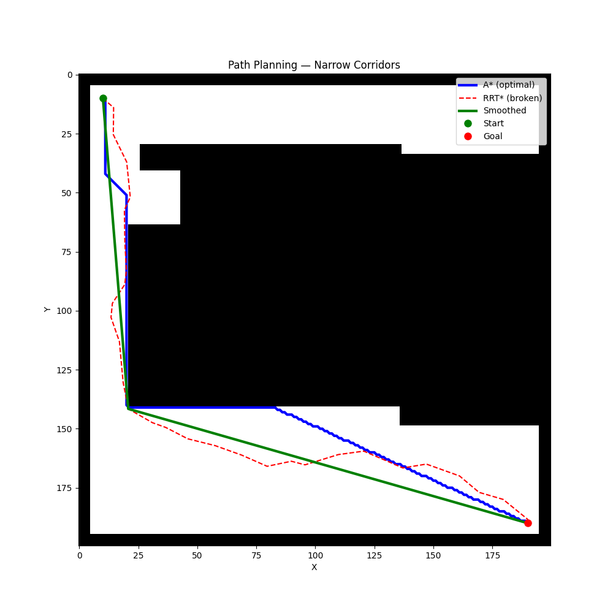

# HW5_Path_Planning — Path Planning (A* vs RRT* + Smoothing)

## Проблема
Реализовать поиск пути на собственных occupancy grids (200×200), сравнить классический A* и RRT*, выполнить Path Smoothing.

## Как решено
- Сгенерированы 3 собственные карты (Simple, Maze, Narrow Corridors).  
- Реализован A* (эталон оптимальности).  
- Реализован RRT* с перестройкой дерева.  
- Добавлен shortcut-based Path Smoothing.  
- Библиотеки: numpy, matplotlib, imageio.

## Результаты

**Визуализация траекторий на всех картах:**

  
  

**Сравнение по метрикам**

| Map               | A* length | A* time (s) | A* expanded | RRT* length | RRT* time (s) | RRT* nodes | Smoothed length |
|-------------------|-----------|-------------|-------------|-------------|---------------|------------|-----------------|
| Simple Map        | 270.96    | 0.1328      | 15000       | 267.18      | 0.0361        | 267        | **261.24**      |
| Maze Map          | 311.97    | 0.2100      | 21497       | 328.27      | **0.0189**    | 146        | 310.18          |
| Narrow Corridors  | 324.85    | 0.1831      | 19232       | 323.67      | 0.0562        | 221        | 308.06          |

## Выводы
- A* гарантирует короткий путь, но сильно замедляется при росте разрешения сетки (большое количество расширяемых узлов).  
- RRT* значительно быстрее, особенно в свободном пространстве (Maze Map — 0.019 с).  
- Path Smoothing стабильно улучшает траекторию, делая её короче и гладче.  
- В узких коридорах RRT* показывает результат, близкий к A* по длине.

Полный код и все вычисления — в `HW5_Path_Planning.ipynb`.